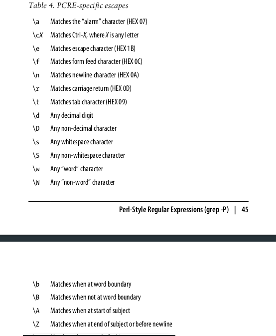

# grep基础

一. 概括

1. 输入： **文件**或命令输出

2. 目标： **固定字符串**或模式

3. 引号： 最好单引号‘，取消shell的特殊符号展开

4. 转义符： 转义序列传达表示特殊含义; 取消元字符的特殊含义

5. 注意点： grep默认以行(\n)单位进行处理!

二. 正则

1. 元字符

   

   

   

   这是所有的正则元字符

2. 其他：

   - 优先级：先数量，再字符串连接，再选择(|) 
   - 连接:  'pat1'  'pat2' 'pat3' 

三. 用法

1. 基础正则

	1. 匹配控制
        * -e 确保后面的是正则，对正则模式前缀是-有用,也可以用于指定多个样式
        * -f 模式文件
        * -i 忽略大小写
        * -v 反向
        * -w 把后面的模式当作word,等于在模式前后加\b
        * -x 当作一行的内容

	2. 通用输出控制
        * -c 匹配的行数
        * --color=[auto|never|always] 颜色
        * -l 列出包含模式的文件,first match then stop in a file
        * -L 同上相反 
        * -m num 在一个文件中最多搜索到num个匹配行，停止搜索文件
        * -o 只输出匹配到的模式，而不是完整的行，一行一个
        * -q 安静模式，多用于脚本，退出码0表示成功，1失败，2程序错误
        * -s 由于权限或文件不存在产生的错误信息被忽略，多用于脚本
	
	3. 输出前缀控制
        * -b 每一匹配行的字节偏移而不是行号
        * -H 包含文件名，多文件默认选项
        * -h 不包含文件名，当搜索整个文件系统时特有用(多文件)
        * --label=LABEL 标签
        * -n 行号
        * -T 在匹配行前插入tab,在匹配行和grep产生的信息之间插入，有利
        * -u 只应用MS-DOS平台，与-b连用，消除回车
        * -Z 在每一个文件后打印一个ASCII的NUL，以\0字节作为文件结束符

	4. 上下文
        * -A num After，在匹配行后
        * -B num Before,在匹配行前
        * -C num 在匹配行前后
	
	5. 文件和目录
        * -a 等价于--binary-files=text
        * -I 等价于--binary-files=without-match
        * --binary-files=Type,分三种binary,without-match,text
        	binary默认选项，简单输出信息，
        	without-match会忽略二进制文件
        	text会把二进制文件当文本，可能会产生乱码，tput init或tput reset
        * -D Action, Action包括skip和read,搜索FIFO和soket或者磁盘装置
        	grep -D read 123-45-6789 /dev/hda1
        * -d Action  path 作为输入文件的目录该如何处理,行为同上

        * --exclude=GLOB(通配符模式*,?,[])
           		grep --exclude=PATTERN path
        * --exclude-from=FILE
        	grep --exclude-from=FILE path (通配符)模式写入了特定文件中,每行一个模式
        * --exclude-dir=DIR
        	grep --exclude=DIR,需要与-r选项连用
        * --include=GLOB  限定输入文件
        	grep --include=*.log  pattern filename
        * -R,-r 循环

	6. 其他（略）

2. 扩展正则(-E)

    * 特殊字符: ? , +, {n, m}, |, ()

    * 注意点: 表示{的字面意思，使用[{]表达

3. 固定字符串(-F)

   * 注意点：模式是固定字符串,不包括元字符、通配符;

   * 选项:
		* -f newfile 输出文件到newfile
		* -e pat1 -e pat2 这样可以指定多个模式(因为没有元字符)

4. Perl形式正则(-P)
	* Perl的特殊符号
		

	* 八进制搜索/40和十六进制搜索\x{0b0b...}
	* 语言有关的特殊字符（略）
	* 四种不同的匹配选项: i, m, s, x

四. 常用模式(egrep)

- ip地址

   1. \b[0-9]{1,3}(\\.[0-9]{1,3}){3}\b

   2. \b((25[0-5]|2\[0-4][0-9]|[01]?\[0-9][0-9]?)\\.){3}

      (25[0-5]|2\[0-4][0-9]|[01]?\[0-9][0-9]?)\b

- mac地址

   \b[0-9a-f]{2}(:[0-9a-f]{2}){5}\b

- URL

  http://[a-zA-Z0-9.]+\.[a-zA-Z]{2,3}

- email地址

  \b[a-z0-9]{1,}@*\\.(com|net|org|uk|mil|gov|edu)\b
